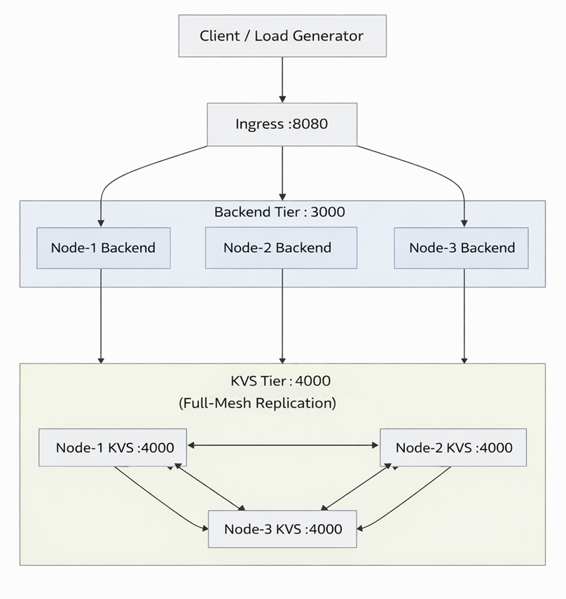

<div align="right">

**Language**: [한국어](./readme.md) | [English](./readme_en.md)

</div>

<div align="center">

# Clustering Project
### RocksDB 기반 분산 KVS + Node.js Backend + Ingress 실험 환경

고부하 환경에서 안정성, 지연 시간, 확장성을 검증하기 위한 멀티노드 실험 프로젝트입니다.

</div>

## 한눈에 보기

| 영역 | 경로 | 역할 |
|---|---|---|
| Ingress | `ingress/` | 외부 트래픽 진입점, least-inflight 라우팅, circuit breaker, admission control |
| Node (개별 노드) | `node/` | `kvs`(C++/RocksDB) + `server/backend`(Node.js API) |
| 실험 도구 | `stress_test/`, `create_account.js` | 부하 생성, 사용자 계정 대량 생성, 실험 반복 자동화 |

## 아키텍처

<p align="center">
  
</p>

## 핵심 특징

- Ingress: least-inflight 라우팅, queue timeout 기반 load shedding, upstream circuit breaker
- Backend: 무상태 토큰 인증, admission control, `/api/posts` 캐시와 중복 요청 억제
- KVS: RocksDB 기반 분산 저장소, 노드 간 replication/fan-out read
- 실험: Node 기반 경량 스트레스 테스트 + 계정 시드 스크립트

## 저장소 구조

```text
.
├── ingress/                 # Ingress 서버 (Node.js)
├── node/                    # 개별 노드
│   ├── kvs/                 # KVS 서버 (C++ / RocksDB)
│   └── server/backend/      # API 서버 (Node.js)
├── stress_test/             # 부하 테스트 스크립트
├── create_account.js        # 계정 대량 생성/검증 스크립트
├── readme.md                # 한국어 문서
└── readme_en.md             # English documentation
```

## 빠른 시작

### 1) 사전 준비

- Node.js 18+
- npm
- CMake 3.10+
- C++17 컴파일러
- RocksDB 및 링크 라이브러리(`snappy`, `zstd`, `zlib`, `bz2`, optional `lz4`)

### 2) 환경 파일 준비

```bash
cp node/.env.example node/.env
cp ingress/.env.example ingress/.env
cp stress_test/.env.example stress_test/.env
```

### 3) Node 의존성 설치

```bash
cd ingress && npm install
cd ../node/server/backend && npm install
```

### 4) KVS 빌드

```bash
cd /root/2025/clustering_project/node/kvs
cmake -S . -B build
cmake --build build -j"$(nproc)"
```

## 실행 순서

각 프로세스는 별도 터미널에서 실행하는 것을 권장합니다.

### 1) KVS 실행

```bash
cd /root/2025/clustering_project
ENV_PATH=/root/2025/clustering_project/node/.env ./node/kvs/build/kvsd
```

### 2) Backend 실행

```bash
cd /root/2025/clustering_project
ENV_PATH=/root/2025/clustering_project/node/.env node node/server/backend/server.js
```

### 3) Ingress 실행

```bash
cd /root/2025/clustering_project
ENV_PATH=/root/2025/clustering_project/ingress/.env node ingress/server.js
```

### 4) 헬스체크

```bash
curl http://<ingress-host>:8080/healthz
curl http://<backend-host>:3000/healthz
```

## 실험 세팅

### A. 계정 시드 생성 (`create_account.js`)

`create_account.js`는 `POST /api/register -> POST /api/login -> GET /api/me`를 순서대로 수행해 계정 생성 및 인증 가능 여부를 검증하고, 결과를 `create_accounts_trace.json`으로 기록합니다.

```bash
cd /root/2025/clustering_project
ENV_PATH=/root/2025/clustering_project/node/.env \
BASE_URL=http://127.0.0.1:8080 \
USER_COUNT=1000 \
CONCURRENCY=32 \
node create_account.js
```

주요 옵션:
- `USER_COUNT`, `START_INDEX`, `CONCURRENCY`
- `EMAIL_PREFIX`, `EMAIL_DOMAIN`, `PASSWORD`
- `REQUEST_TIMEOUT_MS`, `REQUEST_RETRIES`
- `TRACE_PATH`

### B. 부하 테스트 (`stress_test/`)

```bash
cd /root/2025/clustering_project/stress_test
node http_stress.js
node max_users_1hz.js
```

- `http_stress.js`: 고정 타겟에 연속 요청을 보내며 RPS/오류율 확인
- `max_users_1hz.js`: 사용자당 1Hz(`POST + GET`) 기준 최대 동시 사용자 범위 탐색

## 환경변수 파일 가이드

- `node/.env`: 개별 노드(KVS + Backend) 설정
- `ingress/.env`: Ingress 라우팅 및 보호 정책 설정
- `stress_test/.env`: 실험 강도, 성공 기준, 타임아웃 설정

## Git 추적 정책

현재 `.gitignore`는 아래만 제외합니다.

- 의존성 코드: `**/node_modules/`
- 비밀 설정: `**/.env` (`.env.example`은 커밋 가능)
- Node DB 내용물: `node/**/db/**` (디렉터리 자체는 유지)

즉, 위 항목 외에는 실험 코드와 설정을 모두 커밋하는 정책입니다.
