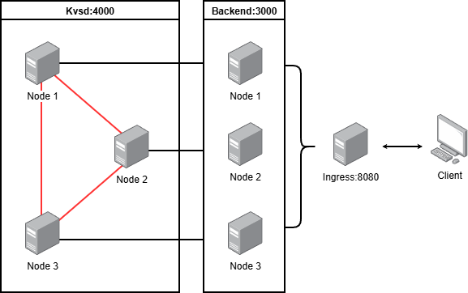
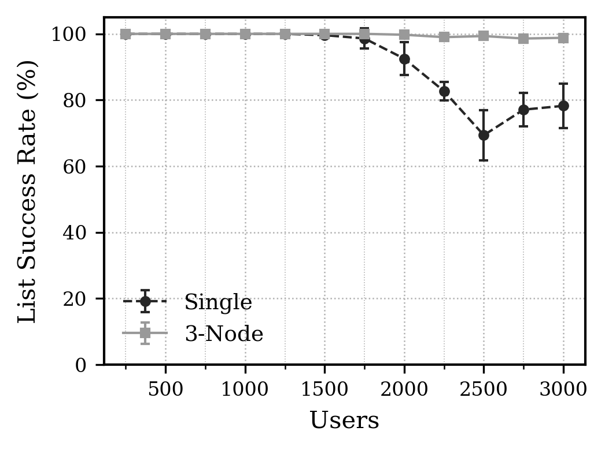
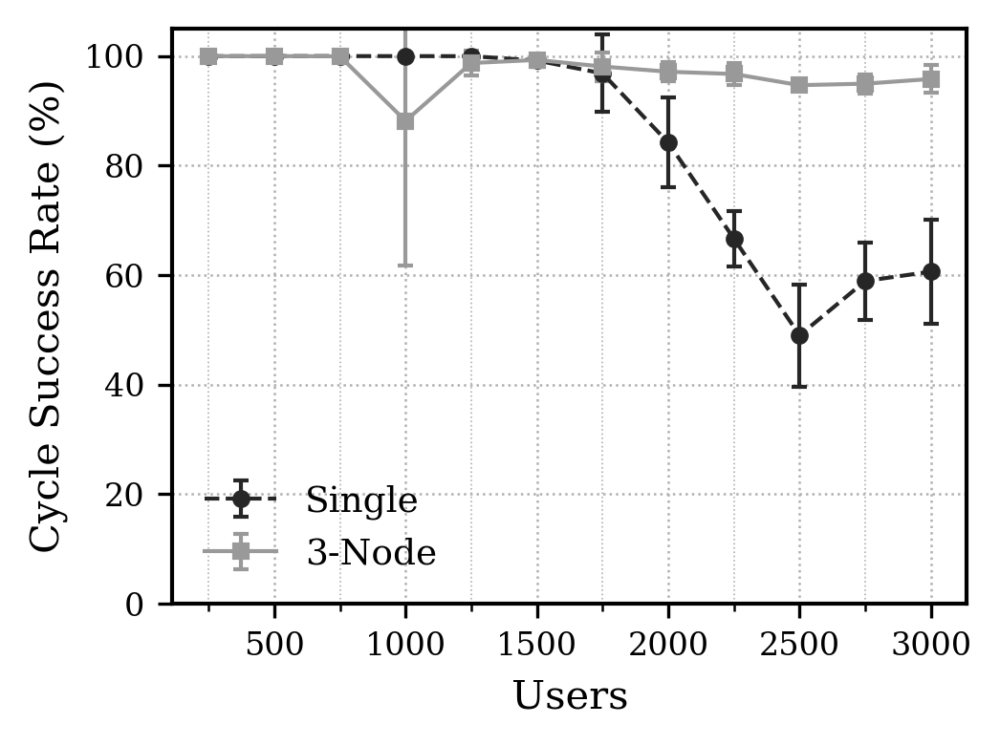
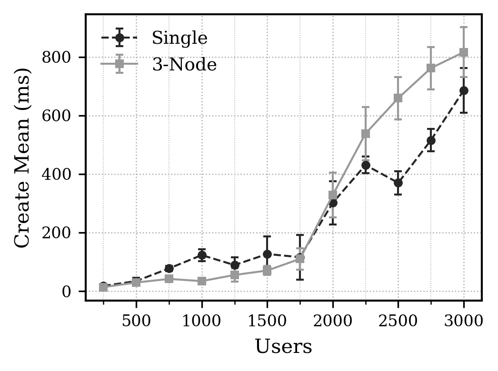
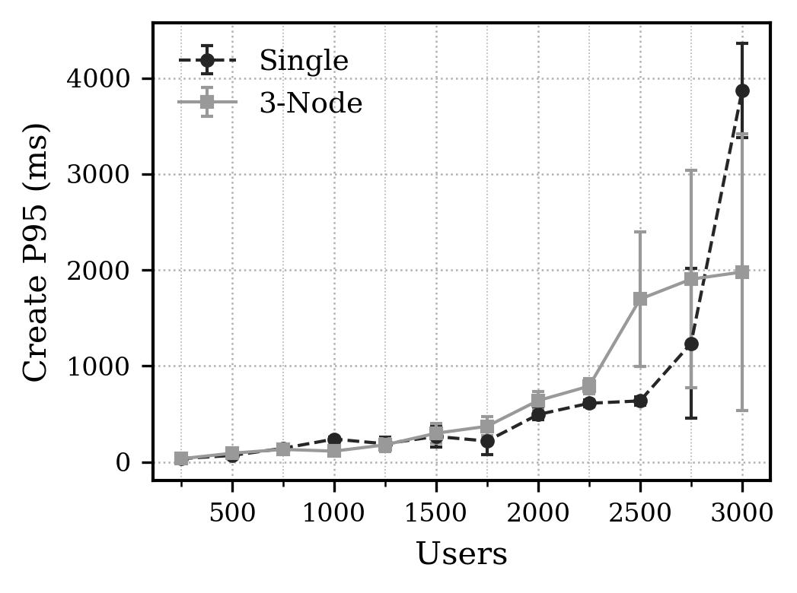
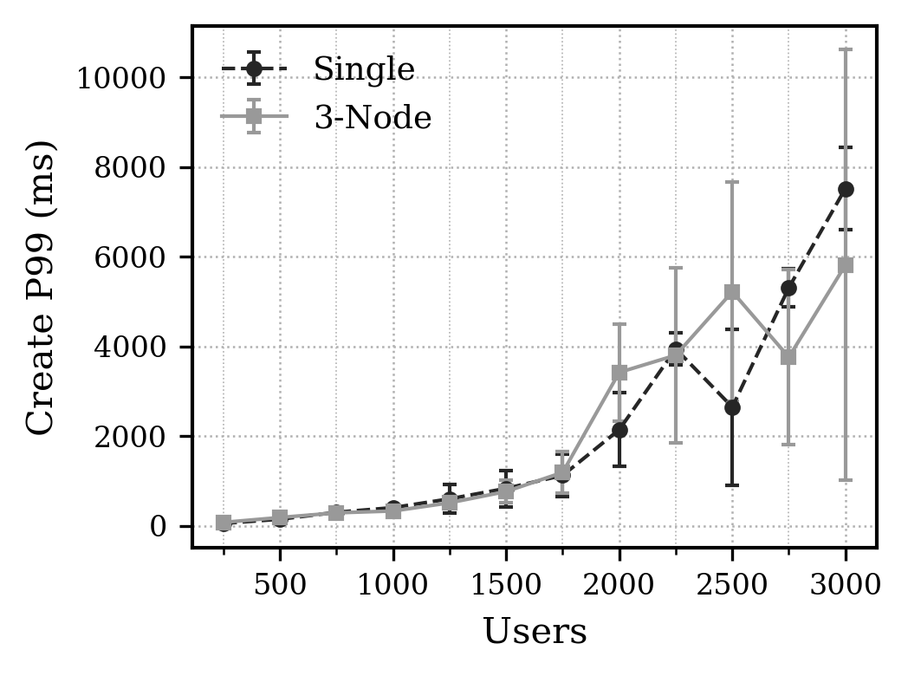
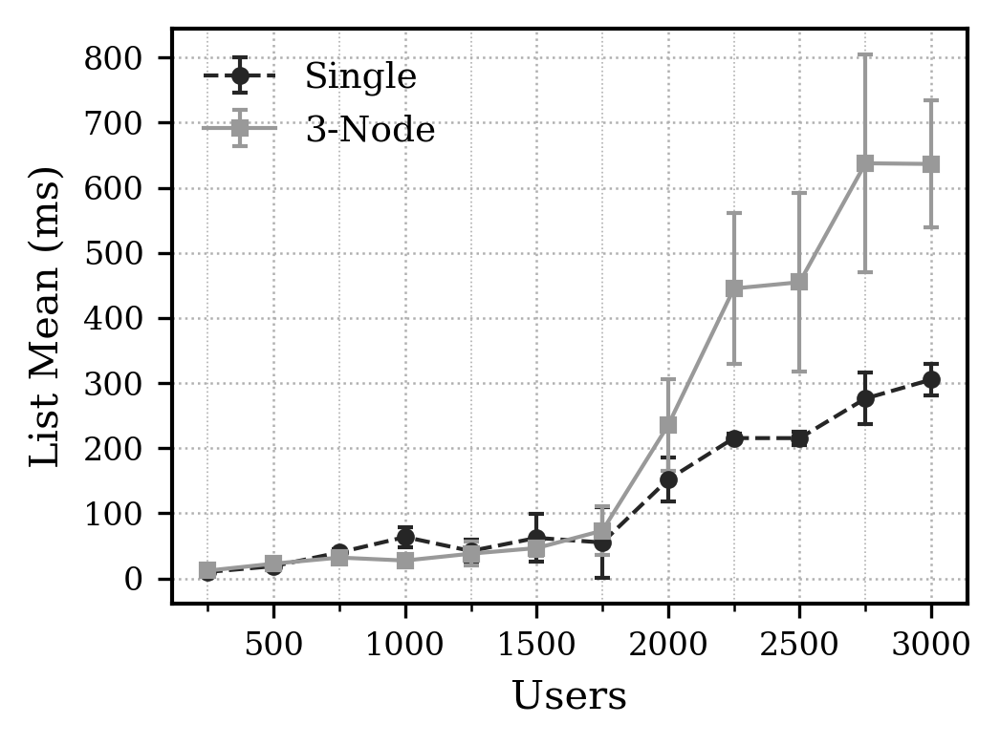
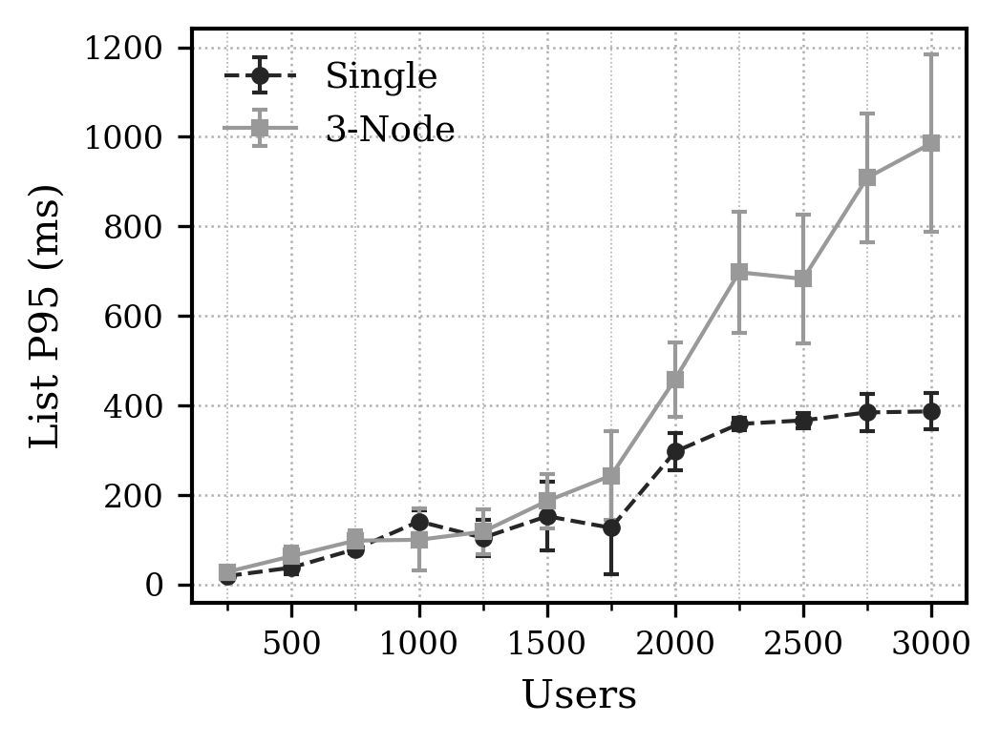
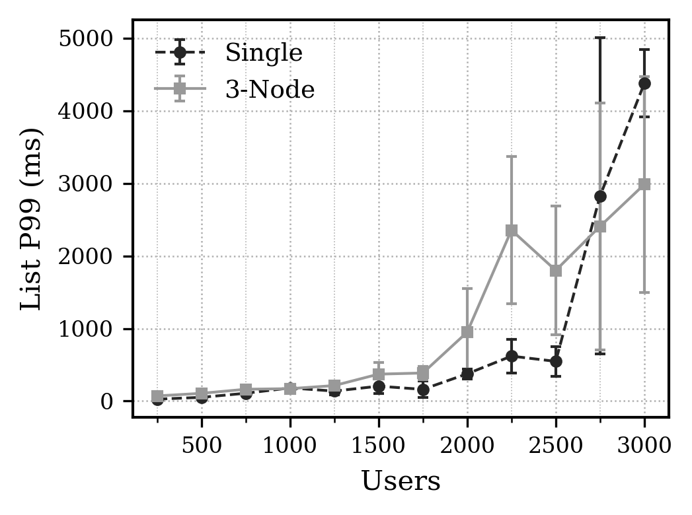

<div align="right">

**Language**: [한국어](./readme.md) | [English](./readme_en.md)

</div>

<div align="center">

# Clustering Project
### RocksDB 기반 분산 KVS + Node.js Backend + Ingress 실험 환경

고부하 환경에서 안정성, 지연 시간, 확장성을 검증하기 위한 분산 환경 실험 프로젝트입니다.

</div>

<a id="toc-overview"></a>
<details>
<summary><strong>1. 한눈에 보기</strong></summary>

| 영역 | 경로 | 역할 |
|---|---|---|
| Ingress | `ingress/` | 외부 트래픽 진입점, least-inflight 라우팅, circuit breaker, admission control |
| Node (개별 노드) | `node/` | `kvs`(C++/RocksDB) + `server/backend`(Node.js API) |
| 실험 도구 | `stress_test/`, `create_account.js` | 부하 생성, 사용자 계정 대량 생성, 실험 반복 자동화 |

</details>

<a id="toc-architecture"></a>
<details>
<summary><strong>2. 아키텍처</strong></summary>

<p align="center">
  
</p>

</details>

<a id="toc-key-features"></a>
<details>
<summary><strong>3. 핵심 특징</strong></summary>

- Ingress: least-inflight 라우팅, queue timeout 기반 load shedding, upstream circuit breaker
- Backend: 무상태 토큰 인증, admission control, `/api/posts` 캐시와 중복 요청 억제
- KVS: RocksDB 기반 분산 저장소, 노드 간 replication/fan-out read
- 실험: Node 기반 경량 스트레스 테스트 + 계정 시드 스크립트

</details>

<a id="toc-repo-layout"></a>
<details>
<summary><strong>4. 저장소 구조</strong></summary>

```text
.
├── ingress/                 # Ingress 서버 (Node.js)
├── node/                    # 개별 노드
│   ├── kvs/                 # KVS 서버 (C++ / RocksDB)
│   └── server/backend/      # API 서버 (Node.js)
├── stress_test/             # 부하 테스트 스크립트
├── create_account.js        # 계정 대량 생성/검증 스크립트
├── readme.md                # 한국어 문서
└── readme_en.md             # English documentation
```

</details>

<a id="toc-quick-start"></a>
<details>
<summary><strong>5. 빠른 시작</strong></summary>

<a id="toc-quick-start-1"></a>
### 1) 사전 준비

- Node.js 18+
- npm
- CMake 3.10+
- C++17 컴파일러
- RocksDB 및 링크 라이브러리(`snappy`, `zstd`, `zlib`, `bz2`, optional `lz4`)

<a id="toc-quick-start-2"></a>
### 2) 환경 파일 준비

```bash
cp node/.env.example node/.env
cp ingress/.env.example ingress/.env
cp stress_test/.env.example stress_test/.env
```

<a id="toc-quick-start-3"></a>
### 3) Node 의존성 설치

```bash
cd ingress && npm install
cd ../node/server/backend && npm install
```

<a id="toc-quick-start-4"></a>
### 4) KVS 빌드

```bash
cd /root/2025/clustering_project/node/kvs
cmake -S . -B build
cmake --build build -j"$(nproc)"
```

</details>

<a id="toc-run-order"></a>
<details>
<summary><strong>6. 실행 순서</strong></summary>

각 프로세스는 별도 터미널에서 실행하는 것을 권장합니다.

<a id="toc-run-order-1"></a>
### 1) KVS 실행

```bash
cd /root/2025/clustering_project
ENV_PATH=/root/2025/clustering_project/node/.env ./node/kvs/build/kvsd
```

<a id="toc-run-order-2"></a>
### 2) Backend 실행

```bash
cd /root/2025/clustering_project
ENV_PATH=/root/2025/clustering_project/node/.env node node/server/backend/server.js
```

<a id="toc-run-order-3"></a>
### 3) Ingress 실행

```bash
cd /root/2025/clustering_project
ENV_PATH=/root/2025/clustering_project/ingress/.env node ingress/server.js
```

<a id="toc-run-order-4"></a>
### 4) 헬스체크

```bash
curl http://<ingress-host>:8080/healthz
curl http://<backend-host>:3000/healthz
```

</details>

<a id="toc-experiment-setup"></a>
<details>
<summary><strong>7. 실험 세팅</strong></summary>

<a id="toc-experiment-setup-a"></a>
### A. 계정 시드 생성 (`create_account.js`)

`create_account.js`는 `POST /api/register -> POST /api/login -> GET /api/me`를 순서대로 수행해 계정 생성 및 인증 가능 여부를 검증하고, 결과를 `create_accounts_trace.json`으로 기록합니다.

```bash
cd /root/2025/clustering_project
ENV_PATH=/root/2025/clustering_project/node/.env \
BASE_URL=http://127.0.0.1:8080 \
USER_COUNT=1000 \
CONCURRENCY=32 \
node create_account.js
```

주요 옵션:
- `USER_COUNT`, `START_INDEX`, `CONCURRENCY`
- `EMAIL_PREFIX`, `EMAIL_DOMAIN`, `PASSWORD`
- `REQUEST_TIMEOUT_MS`, `REQUEST_RETRIES`
- `TRACE_PATH`

<a id="toc-experiment-setup-b"></a>
### B. 부하 테스트 (`stress_test/`)

```bash
cd /root/2025/clustering_project/stress_test
node http_stress.js
node max_users_1hz.js
```

- `http_stress.js`: 고정 타겟에 연속 요청을 보내며 RPS/오류율 확인
- `max_users_1hz.js`: 사용자당 1Hz(`POST + GET`) 기준 최대 동시 사용자 범위 탐색

</details>

<a id="toc-env-guide"></a>
<details>
<summary><strong>8. 환경변수 파일 가이드</strong></summary>

- `node/.env`: 개별 노드(KVS + Backend) 설정
- `ingress/.env`: Ingress 라우팅 및 보호 정책 설정
- `stress_test/.env`: 실험 강도, 성공 기준, 타임아웃 설정

</details>

<a id="toc-experiment-result"></a>
<details>
<summary><strong>9. 실험 과정 및 결과</strong></summary>

<dl>
<dd>

<a id="main-sec-1"></a>
<details>
<summary><strong>9-1) 실험 인프라</strong></summary>

서버는 kamatera에서 제공하는 클라우드 서버를 최대 4개까지 이용하였으며, 모든 실험 노드는 동일 스펙으로 구성했습니다.

- Provider: Kamatera (server location:Tokyo)
- OS: Ubuntu 24.04 64bit
- Availability Type
- vCPU: 2
- RAM: 2GB
- SSD: 20GB

토폴로지 구성:

- `Single Node`: `(1node) + (ingress + max_users_1hz.js)` = 총 2개 노드
- `3-Node`: `(3node) + (ingress + max_users_1hz.js)` = 총 4개 노드

</details>

<a id="main-sec-2"></a>
<details>
<summary><strong>9-2) 실험 조건</strong></summary>

`max_users_1hz.js` 기준으로 아래 설정을 사용했고, 실험 중 변경한 값은 `USERS`, `BASE_URL`만입니다.

```dotenv
USERS=1000
# Common
BASE_URL=http://<ingress-host>:8080
REQUEST_TIMEOUT_MS=3000
WORKERS=4
PROGRESS_INTERVAL_SEC=5

# http_stress.js
TARGET=http://<ingress-host>:8080/healthz
METHOD=GET
CONCURRENCY_PER_WORKER=256
DURATION_SEC=30
TARGET_HZ=1
MAX_SOCKETS_PER_WORKER=1024
KEEP_ALIVE=true
PRINT_INTERVAL_MS=1000

# max_users_1hz.js
PASSWORD=Passw0rd!
EMAIL_PREFIX=k6user
EMAIL_DOMAIN=example.com
USER_START_INDEX=1
USER_START_SPREAD_MS=0
GET_PATH=/api/posts
POST_PATH=/api/posts
MIN_LOGIN_OK_RATE=0.98
MIN_CYCLE_OK_RATE=0.98
POST_P95_MS=1500
GET_P95_MS=1500
LOGIN_CONCURRENCY=64
```

반복 실험 실행 스크립트:
- `Single Node`: `stress_test/single_experiment.sh`
- `3-Node`: `stress_test/cluster_experiment.sh`
- 두 스크립트 모두 기본값으로 `RUN_COUNT=5`, `USER_START=250`, `USER_STEP=250`, `USER_END=3000` 구간을 순회하며 결과를 기록합니다.

</details>

<a id="main-sec-3"></a>
<details>
<summary><strong>9-3) 판정 기준</strong></summary>

각 사용자 구간(stage)은 아래 기준을 모두 만족하면 `pass=yes`로 판정:

- `cycle_ok_rate >= 98%`
- `login_ok_rate >= 98%`
- `create_post_p95 <= 1500ms`
- `list_posts_p95 <= 1500ms`

</details>

<a id="main-sec-4"></a>
<details>
<summary><strong>9-4) 핵심 결과 (CSV 집계)</strong></summary>

데이터 소스:
- `result/final_result/single_node_result.csv`
- `result/final_result/three_node_result.csv`

집계 방식:
- 각 사용자 구간(`users`)별 5회 반복 실험 평균값
- `cycle 성공률 = cycle_ok_num / cycle_ok_den * 100`
- `stage_pass`는 보조지표로만 사용(이진 판정 특성상 외적 요인에 민감)

해석 원칙:
- 단일 구간 결과보다 `사용자 구간별 반복 평균 추세`를 우선 해석
- `stage_pass 전체 통과`보다 고부하 연속 구간의 `성공률/지연시간 추세`를 우선 비교

| 구간/지표 (5회 평균) | Single Node | 3-Node |
|---|---:|---:|
| 중부하(1250~1750) cycle 성공률 | 98.66% | 98.70% |
| 중부하(1250~1750) create/list 성공률 | 99.08% / 99.40% | 98.70% / 100.00% |
| 고부하(2000~3000) cycle 성공률 | 63.89% | 95.86% |
| 고부하(2000~3000) create/list 성공률 | 76.32% / 79.98% | 96.18% / 99.09% |
| 고부하(2000~3000) create/list p95 | 1369.8ms / 358.8ms | 1402.2ms / 746.6ms |
| 2000 users cycle 성공률 | 84.19% | 97.14% |
| 3000 users cycle 성공률 | 60.64% | 95.81% |
| `stage_pass=yes` 비율 (전체 구간, 보조) | 55.00% | 56.67% |

관찰 포인트:

- 고부하 구간(2000~3000 users)에서 `3-Node`의 cycle 성공률은 `Single Node` 대비 `+31.97pp` 높았습니다.
- `3-Node`는 2000/3000 users 모두에서 cycle 성공률이 더 높아, 실패율 방어 측면의 이점이 확인됩니다.
- 같은 구간에서 `3-Node`는 성공률 우위를 보이지만, `list_posts` p95는 더 높아지는 trade-off가 확인됩니다.

</details>

<a id="main-sec-5-1"></a>
<details>
<summary><strong>9-5-1) 성공률 그래프</strong></summary>

<p>
  
  
  
</p>

</details>

<a id="main-sec-5-2"></a>
<details>
<summary><strong>9-5-2) create_post 지연시간 그래프</strong></summary>

<p>
  
  
  
</p>

</details>

<a id="main-sec-5-3"></a>
<details>
<summary><strong>9-5-3) list_posts 지연시간 그래프</strong></summary>

<p>
  
  
  
</p>

</details>

<a id="main-sec-6"></a>
<details>
<summary><strong>9-6) 결론</strong></summary>

`result/final_result` 기준(2026-02-26 ~ 2026-02-27, 각 구성 5회 반복) 결론은 다음과 같습니다.

- `stage_pass` 전체 통과 횟수는 이진 임계값 지표라서, 실험 간 간격/시스템 상태 같은 외적 요인의 영향을 크게 받을 수 있어 보조지표로만 해석하는 것이 적절합니다.
- 실질 부하 구간(2000~3000 users)에서는 `3-Node`가 cycle/create/list 성공률에서 모두 뚜렷한 우위를 보여, 실패율 방어 관점의 수평 확장 효과가 명확했습니다.
- 다만 같은 구간에서 `3-Node`의 tail latency(특히 `list_posts` p95/p99)는 더 높게 나타나므로, 운영 평가는 `성공률`과 `tail latency`를 동시 관리해야 합니다.

정리하면, 이번 데이터는 `3-Node`가 고부하 안정성(성공률)에서 유의미한 이점을 제공하되, 지연시간 꼬리 구간 최적화가 함께 필요함을 보여줍니다.

</details>

</dd>
</dl>

</details>
